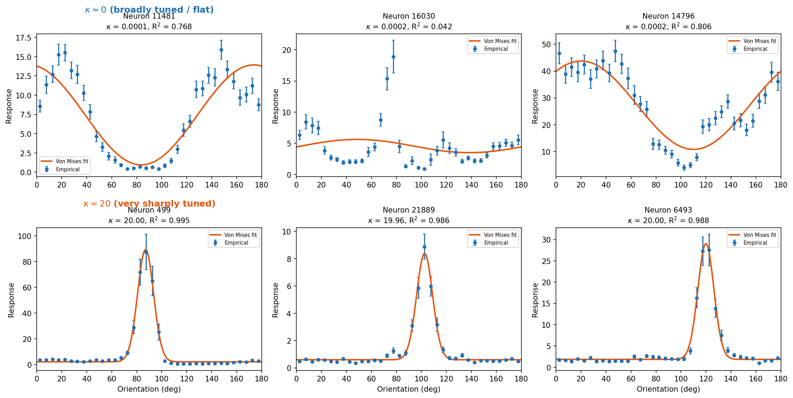
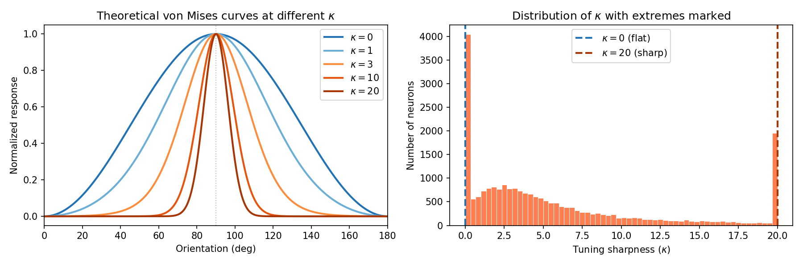
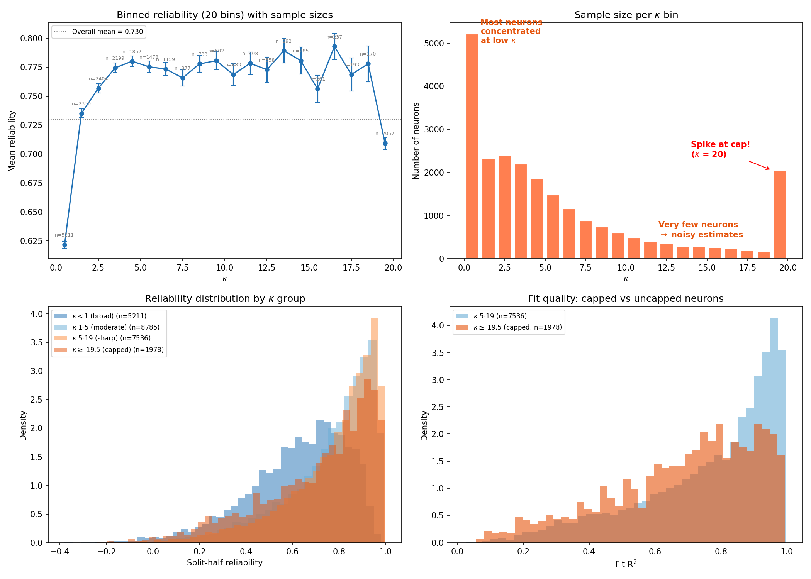
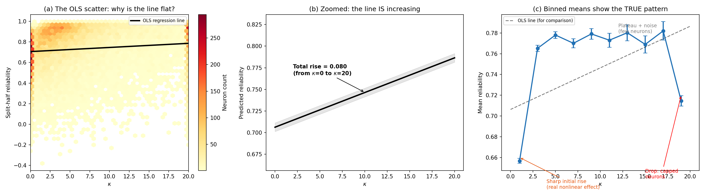

# Project Understanding Questions & Answers

---

## Question 1: What do tuning curves look like at the extremes of kappa (kappa ~ 0 and kappa ~ 20)?

### Answer

The tuning sharpness parameter kappa controls how narrowly tuned a neuron is to its preferred orientation. At the two extremes:

**Kappa ~ 0 (broadly tuned / essentially flat):**
- The von Mises curve becomes nearly flat: exp(0 * cos(...)) = exp(0) = 1 for all orientations
- The neuron responds roughly equally to all orientations --- it has no meaningful orientation preference
- In our data, **3,661 neurons** (15.5%) have kappa < 0.05
- These neurons tend to have lower fit R-squared (mean R-squared = 0.38) because a flat line cannot capture much variance
- Their lower reliability (mean = 0.59) makes sense: if there is no orientation signal, odd and even trials are just two samples of noise

**Kappa ~ 20 (very sharply tuned, at the cap):**
- The von Mises curve becomes an extremely narrow peak, almost like a delta function
- The neuron responds strongly to a tiny range of orientations and is nearly silent elsewhere
- In our data, **1,978 neurons** (8.4%) have kappa >= 19.5 (hitting the fitting cap at 20)
- IMPORTANT: many of these neurons hit the cap not because they are genuinely infinitely sharp, but because the optimizer ran up against the bound. This is an **artifact of the fitting constraint**

See the figures below:

*Figure Q1a: Real example neurons at both extremes. Top row: kappa near 0 (flat curves, no clear preferred orientation). Bottom row: kappa near 20 (very narrow peaks at the preferred orientation).*

*Figure Q1b: Left --- Theoretical von Mises curves at different kappa values (all normalized, preferred orientation = 90 deg). As kappa increases, the peak narrows dramatically. Right --- The kappa distribution, showing where these extremes fall in the population.*

---

## Question 2: Why does binned mean reliability rise sharply for kappa > 1, oscillate in the middle, and drop at the end?

### Answer

The "binned reliability vs. sharpness" plot shows three distinct regimes, each with a different explanation:

### (a) Sharp rise from kappa = 0 to kappa ~ 2 (reliability jumps from ~0.66 to ~0.77)

This is a **real biological/statistical effect**. Neurons with kappa near 0 are essentially untuned --- they have no orientation preference. Their split-half reliability measures the correlation between two tuning curves that are both just noise, so it tends to be low. As soon as kappa exceeds ~1, there is a genuine orientation signal in the tuning curve. Both the odd and even trial halves will show a similar peak, producing a higher correlation. This transition from "no signal" to "clear signal" drives the steep initial rise.

The bin from kappa = 0 to 2 contains **7,541 neurons** (32% of the population), so this is a well-estimated effect.

### (b) Apparent oscillation from kappa ~ 3 to kappa ~ 16 (reliability hovers around 0.77)

This is primarily **sampling noise**, not a real biological oscillation. Here is why:

- The number of neurons per bin **drops dramatically** at higher kappa values:
  - kappa 0-2: 7,541 neurons
  - kappa 2-4: 4,603 neurons
  - kappa 8-10: 1,335 neurons
  - kappa 12-14: 650 neurons
  - kappa 14-16: 546 neurons

- With only ~500-1,300 neurons per bin, the standard error of the mean is 0.005-0.009 (visible as error bars)
- The apparent wiggles are within ~1-2 SEMs of each other --- they are **not statistically meaningful**
- The true underlying relationship is likely a smooth, gentle plateau in this range

Once kappa exceeds ~2, adding more sharpness does not dramatically improve trial-to-trial consistency. The signal is already clear enough for the two halves to correlate well.

### (c) Drop in the last bin (kappa ~ 18-20, reliability drops to ~0.71)

This is an **artifact of the kappa = 20 fitting cap**. The fitting procedure constrains kappa to the range [0, 20]. When the optimizer wants kappa > 20, it gets stuck at 20. These 1,978 "capped" neurons are a **heterogeneous mix**:

- Some are genuinely very sharply tuned
- Others are neurons where the optimizer converged poorly and ran to the boundary
- The capped group has **lower mean fit R-squared** (0.686) compared to the uncapped sharp neurons at kappa 5-19 (R-squared = 0.783)
- This lower fit quality translates to lower reliability, because poor fits often indicate noisy or complex responses

In short: the drop is not because "very sharp tuning causes unreliability" --- it is because the kappa = 20 cap creates a grab bag of neurons with varying quality.

*Figure Q2: Four-panel explanation. (a) Binned reliability with sample sizes per bin --- note how counts drop at higher kappa. (b) Sample size distribution --- the population is concentrated at low kappa, with a spike at the cap (kappa ~ 20). (c) Reliability distributions by kappa group, showing the capped neurons (red) have a broader, lower distribution. (d) Fit quality: capped neurons (orange) have worse R-squared than genuinely sharp neurons (blue), explaining their lower reliability.*

---

## Question 3: What exactly is the split-half reliability scatter showing, and why does the OLS line look so flat?

### Answer

### What is split-half reliability?

Split-half reliability measures **how consistent a neuron's orientation tuning is across repeated trials**. Here is exactly how it works:

1. Take all 4,598 trials and split them into two halves: odd-numbered trials (trial 1, 3, 5, ...) and even-numbered trials (trial 2, 4, 6, ...)
2. For each half, compute a tuning curve: the mean response at each of the 36 orientation bins
3. Compute the **Pearson correlation** between these two 36-element tuning curves
4. This correlation (ranging from -1 to +1) is the split-half reliability

**High reliability (close to 1):** The neuron's tuning curve looks the same whether you use odd or even trials. It is a reliable, consistent responder.

**Low reliability (close to 0):** The tuning curve looks different on different subsets of trials. The neuron's responses are noisy or inconsistent.

**Negative reliability:** The two halves are anti-correlated, which usually means the neuron has no real tuning and both curves are just noise.

### Is the scatter plot the "trendline" for the binned graph?

**Not exactly --- they show different things:**

- The **binned means plot** (right panel of Figure 3 in the report) shows the *average* reliability for neurons grouped by kappa. It reveals the *shape* of the relationship (sharp rise, plateau, drop).
- The **hexbin scatter plot** (left panel) shows every single neuron as a data point, revealing the full *spread* of the data. The OLS line on this plot is a *linear* fit through all 23,589 individual points.

The OLS line is a **straight line forced through a nonlinear relationship** with enormous scatter. The binned means are a better representation of the actual trend.

### Why is the OLS line so flat?

The line IS increasing --- it just looks flat because of the **scale mismatch**:

- The reliability axis spans from -0.38 to +0.997 (a range of 1.38)
- The OLS line predicts a total increase of only **0.080** across the full kappa range (0 to 20)
- That 0.080 increase is only **5.8% of the total reliability range**
- With 23,589 data points scattered across this huge range, a line that rises by 0.080 units looks essentially flat

**Why so small a slope?** Because the relationship between kappa and reliability is:
1. **Nonlinear** --- most of the action happens between kappa 0 and 2, then it plateaus. A straight line averages this into a gentle overall slope.
2. **Noisy** --- kappa and mean response together explain only R-squared = 0.055 (5.5%) of the variance in reliability. The other 94.5% comes from factors we did not measure (noise correlations, behavioral state, calcium indicator dynamics, etc.)

The OLS model is statistically significant (p < 10^-70 for the kappa coefficient) only because we have so many neurons. The *effect size* is modest.

*Figure Q3: (a) The hexbin scatter with OLS line --- appears flat because the total predicted change (0.08) is tiny compared to the data spread. (b) Zoomed in on just the OLS line --- it IS increasing, just very gradually. (c) The binned means (blue circles) reveal the true nonlinear pattern; the OLS line (dashed) is a poor summary because the real relationship is not linear.*

---
